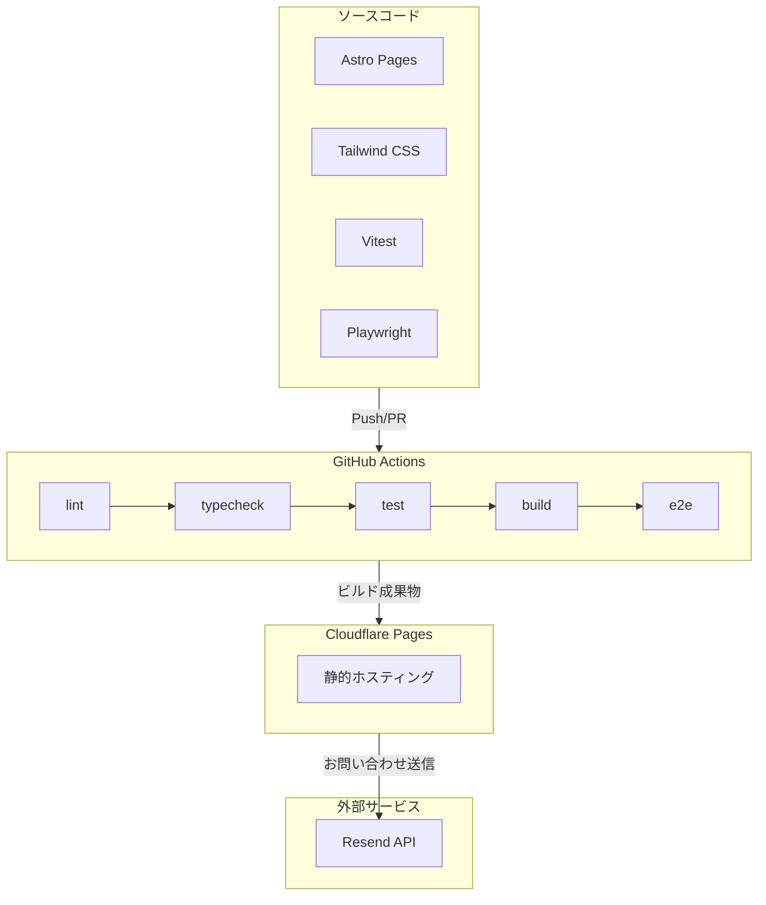

# うぇぶまか

Webサイト制作・LP制作サービスのポートフォリオサイト

## URL

<https://webmaka.com/>

## 技術選定理由

### なぜ Astro か

- **静的サイトに最適**: ポートフォリオは動的コンテンツが少なく、静的出力で十分
- **ゼロJSがデフォルト**: クライアントJSを必要な箇所だけに限定でき、パフォーマンスが高い
- **Islands Architecture**: 必要な部分だけインタラクティブにできる柔軟性
- **Next.js/Nuxtとの比較**: SPAフレームワークはオーバースペック。Astroの方がビルドが速く、出力もシンプル

### なぜ Tailwind CSS v4 か

- **ユーティリティファースト**: コンポーネント単位でスタイルが完結し、CSS肥大化を防ぐ
- **v4の新機能**: CSS変数ベースのテーマ、Viteプラグインによる高速ビルド
- **設計の一貫性**: デザイントークンを`@theme`で一元管理

### なぜ Cloudflare Pages か

- **エッジ配信**: 日本国内でも高速なレスポンス
- **無料枠が充実**: 個人ポートフォリオには十分
- **Vercel/Netlifyとの比較**: 同等機能で、Cloudflareはエッジ性能に強み

### なぜ Biome か

- **ESLint + Prettier統合**: 1ツールで完結し、設定がシンプル
- **高速**: Rustベースで大規模プロジェクトでも快適
- **ESLintとの比較**: 設定ファイルの管理コストが低い

### なぜ Resend か

- **開発者体験**: シンプルなAPI、TypeScript対応
- **無料枠**: 月100通まで無料（ポートフォリオには十分）
- **SendGrid/SESとの比較**: 小規模利用ではResendの方がセットアップが簡単

## アーキテクチャ



## 技術スタック

| 項目 | 技術 | バージョン |
| --- | --- | --- |
| フレームワーク | Astro | 5.16 |
| CSS | Tailwind CSS | 4.1 |
| 言語 | TypeScript | 5.9 |
| Linter/Formatter | Biome | 2.3 |
| ユニットテスト | Vitest | 4.0 |
| E2Eテスト | Playwright | 1.58 |
| UIカタログ | Storybook | 10.1 |
| メール送信 | Resend | 6.6 |
| ホスティング | Cloudflare Pages | - |
| CI | GitHub Actions | - |
| Node.js | - | 22 |

## テスト戦略

### ユニットテスト（Vitest）

ロジックを持つコードに集中してテストを実装。

| 対象 | テスト内容 |
| --- | --- |
| validation.ts | メール形式、名前、メッセージのバリデーション、XSSエスケープ |
| rate-limit.ts | レート制限ロジック |
| Button.astro | 全variant/size、disabled状態、アイコン表示 |
| FormField.astro | ラベル、必須マーク、エラー表示 |
| 他UIコンポーネント | Props適用、レンダリング確認 |

```bash
# テスト実行
npm run test

# カバレッジ付き
npm run test:coverage
```

### E2Eテスト（Playwright）

お問い合わせフローの統合テストを実装。

- 入力バリデーション
- 確認画面でのデータ表示・修正
- 送信成功/失敗/レート制限のハンドリング
- sessionStorageによるデータ復元

```bash
# E2Eテスト実行
npm run test:e2e

# UIモード
npm run test:e2e:ui
```

### テストしないもの

- 静的なカードコンポーネント（ServiceCard、WorkCard等）: ロジックがなく、テストのROIが低い
- Lighthouse CI: CI環境での不安定さから削除。パフォーマンスは手動で定期確認

## CI/CD

GitHub Actionsで以下を自動実行:

```text
Push/PR → lint → typecheck → test → build → e2e
                                       ↓
                              Cloudflare Pages
                               (自動デプロイ)
```

| ジョブ | 内容 |
| --- | --- |
| lint | Biomeによるコードチェック |
| typecheck | `astro check`による型チェック |
| test | Vitestユニットテスト + Codecovカバレッジ |
| build | Astroビルド |
| e2e | Playwrightによる統合テスト |

## セキュリティ

| 対策 | 実装箇所 |
| --- | --- |
| XSSエスケープ | `escapeHtml()`でユーザー入力をサニタイズ |
| レート制限 | IP単位で1分あたり3リクエストまで |
| バリデーション | クライアント + サーバーの二重チェック |
| 環境変数 | APIキーは`.env`で管理、gitignore対象 |

## 開発

```bash
# 依存関係インストール
npm install

# 開発サーバー起動
npm run dev

# ビルド（型チェック含む）
npm run build

# lint/format チェック
npm run lint

# lint/format 自動修正
npm run lint:fix

# Storybook起動
npm run storybook
```

## Storybook

UIコンポーネントのカタログ・ドキュメント

<https://storybook.webmaka.com/>

- mainブランチへのマージで自動デプロイ
- ローカルでは `npm run storybook` で起動（localhost:6006）

## サイト構成

| ページ | パス | 内容 |
| --- | --- | --- |
| トップ | `/` | サービス説明、制作フロー、実績、お問い合わせ |
| About | `/about` | 運営者プロフィール、スキル |
| お問い合わせ | `/contact` | フォーム入力 → 確認 → 送信完了 |
| サンプル集 | `/samples` | UIコンポーネントのサンプル一覧 |
| 404 | `/404` | カスタム404ページ |

## ディレクトリ構成

```text
src/
├── assets/          # 画像（Astro Image最適化対象）
├── components/      # Astroコンポーネント
│   └── ui/          # 再利用可能なUIコンポーネント
├── layouts/         # レイアウト
├── lib/             # ユーティリティ（validation、rate-limit）
├── pages/           # ページ（ファイルベースルーティング）
│   ├── api/         # APIエンドポイント（お問い合わせ送信）
│   └── contact/     # お問い合わせフロー
├── stories/         # Storybookストーリー
└── styles/          # Tailwind CSS設定
```

## UIコンポーネント

`src/components/ui/` に再利用可能なコンポーネントを配置

| コンポーネント | 用途 | テスト |
| --- | --- | --- |
| Button | ボタン（variant: primary/secondary/ghost/cta/gold） | ✓ |
| Badge | バッジ・タグ表示 | ✓ |
| SectionTitle | セクションタイトル | ✓ |
| Heading | 見出し（h1〜h6） | ✓ |
| ContactProgress | お問い合わせステップ表示 | ✓ |
| FormField | フォームフィールドラッパー | ✓ |
| Input | テキスト入力 | ✓ |
| Textarea | テキストエリア | ✓ |
| Select | セレクトボックス | ✓ |
| ServiceCard | サービス紹介カード | - |
| FlowCard | 制作フローカード | - |
| WorkCard | 実績カード | - |
| SkillItem | スキル項目 | - |

## デザイン

### カラースキーム

| 用途 | カラーコード |
| --- | --- |
| 背景（メイン） | `#F7F4E9` |
| 背景（セクション） | `#F5F0E8` |
| メインカラー | `#3D8B6E` |
| アクセント | `#E8A87C` |
| CTA | `#D97757` |
| テキスト | `#374151` |
| サブテキスト | `#6B7280` |

### 特徴

- 温かみのある背景色
- 落ち着いた緑をメインに使用
- 柔らかく、相談しやすい雰囲気
